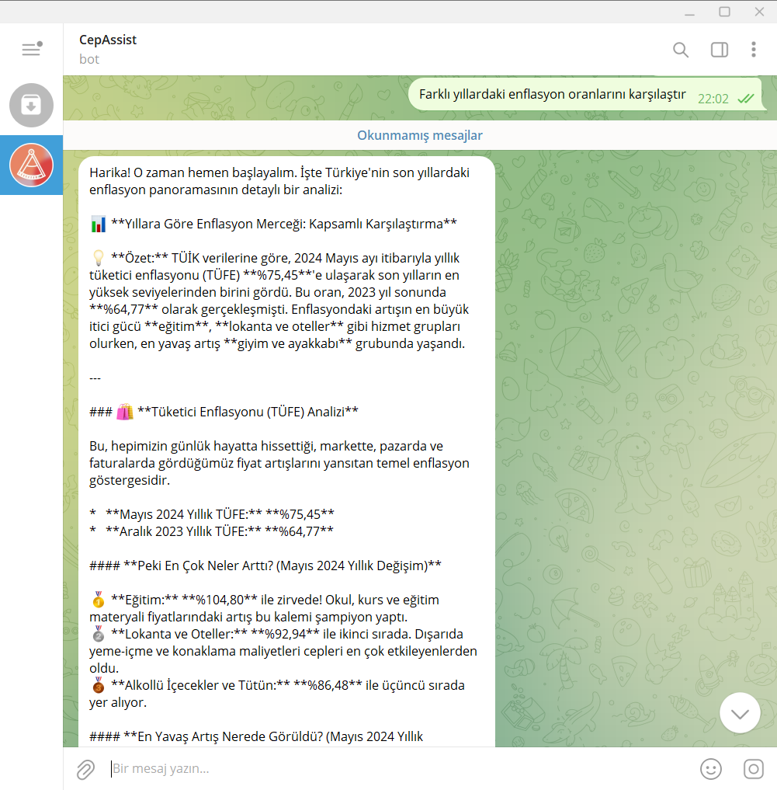
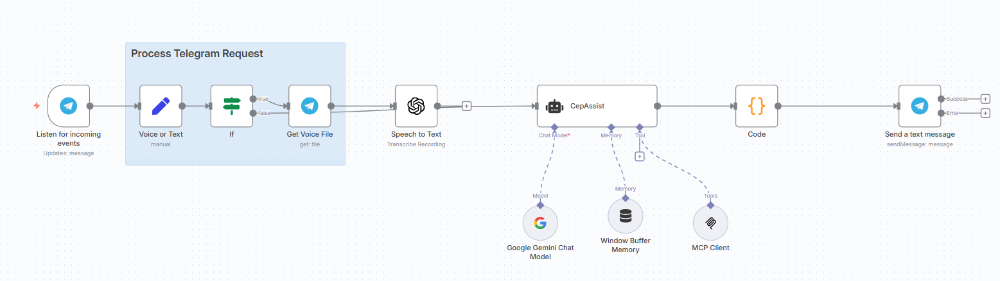
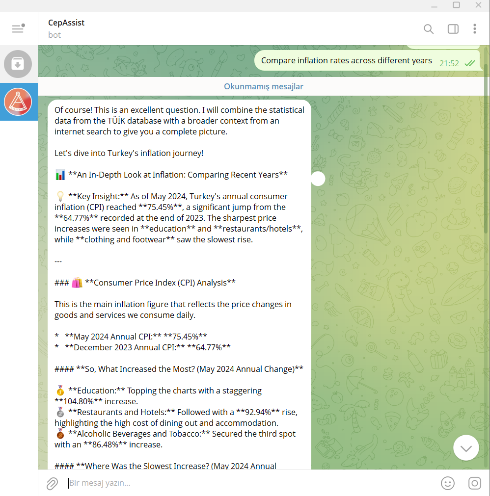

# TÜİK RAG MCP Asistanı | TUIK RAG MCP Assistant

Bu proje, Türkiye İstatistik Kurumu (TÜİK) tarafından yayınlanan binlerce Excel dosyasını işleyerek, bu veriler hakkında doğal dilde sorulan sorulara akıllı ve bağlama uygun cevaplar üreten gelişmiş bir RAG (Retrieval-Augmented Generation) sistemidir.

[Türkçe](#türkçe) | [English](#english)

---

<a name="türkçe"></a>
##  Türkçe Açıklama

<details>
<summary>Detayları görmek için tıklayın</summary>

### 🤖 Örnek Kullanım / Demo




### 🚀 Proje Hakkında

Bu sistem, yapılandırılmamış Excel tablolarını, yapay zeka destekli bir süreçle anlamlı metin parçalarına ("chunk") dönüştürür. Bu metin parçaları daha sonra anlamsal olarak aranabilir vektörlere çevrilir ve bir FAISS veritabanında saklanır. Kullanıcı bir soru sorduğunda, sistem en alakalı bilgileri bu veritabanından çeker ve bu bilgileri kullanarak, Gemini yapay zeka modeline tutarlı ve doğru bir cevap ürettirir.

Proje, n8n iş akışı otomasyon platformu aracılığıyla bir Telegram botuna bağlanarak son kullanıcıya ulaşır.

### 🏛️ Mimarî Şeması



### ✨ Temel Özellikler

* **Yapay Zeka Destekli Veri Ayrıştırma:** Karmaşık TÜİK Excel tablolarını anlamlı cümlelere dönüştürmek için Gemini kullanılır.
* **Anlamsal Arama:** Anahtar kelime aramasının ötesinde, sorunun "anlamına" en yakın verileri bulan vektör tabanlı arama.
* **🧠 Sohbet Hafızası:** n8n'deki `Window Buffer Memory` sayesinde, asistan her kullanıcı için geçmiş konuşmaları hatırlar. Bu, "peki bir önceki yıla göre nasıldı?" gibi takip soruları sormaya ve daha doğal bir diyalog kurmaya olanak tanır.
* **Sesli ve Yazılı Etkileşim:** n8n iş akışı, Telegram üzerinden gönderilen sesli mesajları metne çevirerek, kullanıcıların asistanla hem yazarak hem de konuşarak etkileşim kurmasına olanak tanır.
* **Hazır Veritabanı:** Kullanıcıların saatlerce ve maliyetli bir şekilde veri işlemesini önlemek için önceden oluşturulmuş veritabanı dosyaları.
* **Paralel ve Hızlı Veri İşleme:** `multiprocessing` ile binlerce dosyanın işlenme süresini dramatik ölçüde kısaltır.
* **Sağlam ve Güvenilir:** "Checkpointing" mekanizması sayesinde, herhangi bir hata durumunda işlem kaldığı yerden devam eder.
* **Gelişmiş Hata Yönetimi:** Başarısız olan dosyaları ve hata nedenlerini `failed_files.log`'a kaydederek teşhis ve yeniden işleme imkanı sunar.
* **Güvenli API:** `Bearer Token` (JWT) doğrulaması ile sunucuya sadece yetkili istemcilerin erişmesini sağlar.
* **n8n & Telegram Entegrasyonu:** Hazır `workflow.json` dosyası ile kolay kurulum ve son kullanıcıya sohbet arayüzü sunumu.

### 🛠️ Kullanılan Teknolojiler

* **Backend:** Python 3.10+
* **AI Modelleri:** Google Gemini 2.5 Pro/Flash, `sentence-transformers`
* **Veritabanı:** FAISS (Vektör Arama), Pickle (Veri Saklama)
* **API & Sunucu:** FastMCP, Uvicorn, Flask, Click
* **Tünelleme:** Ngrok (Yerel sunucuyu internete açmak için)
* **Otomasyon:** n8n
* **Arayüz:** Telegram

### 📂 Proje Yapısı

```
.
├── data/
├── images/
├── .gitignore
├── build_vector_db.py      # Veritabanını oluşturan ana betik
├── custom_tuik_scraper.py  # TÜİK'ten veri çeken kazıyıcı
├── dashboard.py            # Güvenlik token'ı üreten web paneli
├── data.json               # İndirilen dosyaların envanteri
├── failed_files.log        # Başarısız işlenen dosyaların kaydı
├── ngrok.exe               # Ngrok tünelleme uygulaması
├── prepare_data.py         # Tüm verileri indiren ve düzenleyen betik
├── requirements.txt        # Gerekli Python kütüphaneleri
├── server.py               # RAG API sunucusu
└── TUIK_Bot_Workflow.json  # n8n için hazır iş akışı dosyası
```

### 🏁 Kurulum ve Kullanım

#### Adım 1: Projeyi ve Bağımlılıkları Kurma
```bash
git clone https://github.com/FatihSuicmez/TUIK_MCP.git
cd TUIK_MCP
pip install -r requirements.txt
```

#### Adım 2: Gerekli Araçları ve Anahtarları Hazırlama
1.  **Telegram Bot Token:** Telegram'da **`@BotFather`** ile konuşarak `/newbot` komutuyla yeni bir bot oluşturun ve size verdiği **token'ı** kaydedin.
2.  **Google Gemini API Anahtarı:** [Google AI Studio](https://aistudio.google.com/app/apikey)'dan bir API anahtarı oluşturun ve kaydedin.
3.  **Ngrok (Zorunlu Araç):** n8n'in yerel makinenizde çalışan `server.py` sunucusuna ulaşabilmesi için `ngrok`'a ihtiyacımız var. [Ngrok indirme sayfasından](https://ngrok.com/download) sisteminize uygun `ngrok` uygulamasını indirin ve proje klasörünüze yerleştirin.

#### Adım 3: Hazır Veritabanını İndirme (Tavsiye Edilen Yöntem)
Veritabanını sıfırdan oluşturmak saatler sürer ve maliyetlidir.
Veritabanı dosyaları (~1 GB) GitHub'ın dosya limiti için çok büyük olduğundan, harici bir bulut depolama servisinde barındırılmaktadır.
1.  [Bu Kısımdan](https://drive.google.com/file/d/18MfO-Q0Oo7UTeT4iWUrIK1STIzrYW09-/view?usp=sharing) database.zip dosyasını indirin.
2.  İndirdiğiniz .zip dosyasını açın.
3.  İçindeki `tuik_faiss.index`,`tuik_chunks.pkl` dosyalarını ve `/data` klasörünü projenin ana klasörüne kopyalayın.

---
#### ⚙️ Alternatif: Veritabanını ve Verileri Sıfırdan Oluşturma (İleri Seviye)
> ⚠️ **Uyarı:** Bu süreç, hem TÜİK sitesinden yüzlerce dosya indireceği hem de bu dosyaları Gemini API ile işleyeceği için **çok uzun sürebilir** ve **önemli maliyetlere** yol açabilir.

1.  **API Anahtarınızı Ayarlayın:** `setx GOOGLE_API_KEY "sizin-api-anahtarınız"` komutuyla anahtarınızı sisteme tanıtın (CMD'yi yeniden başlatın).
2.  **TÜİK Verilerini Çekme ve Hazırlama:** `python prepare_data.py`
3.  **Performans ve Maliyet Ayarlarını Gözden Geçirin:**
    * **Maliyetler:** `build_vector_db.py` betiği, indirilen her dosya için Gemini API'sine bir istek gönderir. Toplu veri işleme gibi görevler için betik içinde `gemini-2.5-flash` gibi daha uygun maliyetli bir model kullanmanız şiddetle tavsiye edilir. Google Cloud üzerinde **Bütçe Alarmları (Billing Alerts)** kurarak beklenmedik faturaların önüne geçebilirsiniz.
    * **Hız:** Betiğin hızı, `build_vector_db.py` içindeki `worker_count` değişkeni ile kontrol edilir. En iyi performans için bu değeri, bilgisayarınızın mantıksal çekirdek sayısının 1 ila 2 katı arasında bir değere ayarlayabilirsiniz (Örn: `worker_count = 8` veya `worker_count = 16`).
4.  **RAG Veritabanını Oluşturun:** `python build_vector_db.py`

---

### 🏃 Kullanım

1.  **Arka Planı ve Tüneli Çalıştırın:**
    * **1. Terminal (Güvenlik Sunucusu):** `python dashboard.py`
    * **2. Terminal (RAG Sunucusu):** `python server.py`
    * **3. Terminal (Ngrok Tüneli):** `./ngrok.exe http 8070` (ve `https://...` adresini kopyalayın).

2.  **n8n'i Yapılandırın:**
    * **Adım 2a: Kimlik Bilgilerini (Credentials) Ekleme**
        n8n'de "Credentials" bölümüne gidin ve şu üçünü oluşturun:
        1.  `Telegram Bot API`: BotFather'dan aldığınız token.
        2.  `Google Gemini`: Google'dan aldığınız API anahtarı.
        3.  `Bearer Auth`: `http://127.0.0.1:8050` adresine giderek oluşturduğunuz token.
    * **Adım 2b: İş Akışını İçe Aktarma ve Ayarlama**
        1.  Projedeki **`TUIK_Bot_Workflow.json`** dosyasını n8n'e aktarın.İçe aktaracağınız iş akışı aşağıdaki gibi görünecektir:
           
        3.  Akıştaki **`MCP Client`** noduna tıklayın. Ayarlarını aşağıdaki gibi yapın:
            * **Credential for Bearer Auth:** Açılır menüden daha önce oluşturduğunuz `Bearer Auth` kimlik bilgisini seçin.
            * **Endpoint URL:** Bu alana, Ngrok terminalinde size verilen `https://...ngrok-free.app` adresini **sonuna `/sse` ekleyerek** yapıştırın. *Örnek: `https://b1a2-c3d4-e5f6.ngrok-free.app/sse`*
        4.  Akıştaki diğer nodlara (`Telegram Trigger`, `Google Gemini`) tıklayarak ilgili kimlik bilgilerini seçtiğinizden emin olun.

3.  **Test Edin:** n8n akışını aktif hale getirin ("Activate") ve Telegram botunuzla konuşmaya başlayın!

### 🔌 MCP Sunucu Aracı

Sunucumuz (`server.py`) tek ve güçlü bir araç sunar:

`answer_question_with_rag(user_question: str, top_k: int = 5)`
* **Amaç:** Kullanıcı sorusunu alır, RAG veritabanında arama yapar ve nihai cevabı üretmesi için bir LLM'e verilecek hazır bir JSON paketi döndürür.
* **Girdi:** `user_question` (kullanıcının sorusu), `top_k` (isteğe bağlı, bulunacak en alakalı sonuç sayısı).
* **Çıktı:** `final_prompt_for_llm` anahtarını içeren ve içinde talimatlar, bulunan bağlam ve kullanıcının sorusu olan bir JSON nesnesi.


</details>

---

<a name="english"></a>
## English Description

<details>
<summary>Click to see details</summary>

### 🤖 Example Usage / Demo



### 🚀 About The Project
This project is an advanced RAG (Retrieval-Augmented Generation) system that processes thousands of Excel files from the Turkish Statistical Institute (TUIK) to provide intelligent answers to natural language questions about this data.

### 🏛️ Architecture Diagram


### ✨ Core Features
* **AI-Powered Data Parsing:** Uses Gemini to convert complex Excel tables into meaningful sentences.
* **Semantic Search:** Vector-based search that finds data closest in "meaning" to a query.
* **🧠 Conversation Memory:** Thanks to `Window Buffer Memory` in n8n, the assistant remembers past conversations for each user, allowing for follow-up questions.
* **Voice and Text Interaction:** The n8n workflow transcribes voice messages, allowing users to interact with the assistant by both writing and speaking.
* **Pre-built Database:** Includes pre-computed database files to save users from hours of processing and API costs.
* **Secure API:** Uses `Bearer Token` (JWT) authentication.
* **n8n & Telegram Integration:** Ready-to-use `workflow.json` for easy setup.

### 🛠️ Tech Stack
* **Backend:** Python 3.10+
* **AI Models:** Google Gemini 2.5 Pro/Flash, `sentence-transformers`
* **Database:** FAISS, Pickle
* **API & Server:** FastMCP, Uvicorn, Flask, Click
* **Tunneling:** Ngrok
* **Automation:** n8n
* **Interface:** Telegram

### 🏁 Setup and Usage

#### Step 1: Clone Project & Install Dependencies
```bash
git clone https://github.com/FatihSuicmez/TUIK_MCP.git
cd TUIK_MCP
pip install -r requirements.txt
```

#### Step 2: Prepare Tools & Keys
1.  **Telegram Bot Token:** Create a new bot by talking to `@BotFather` in Telegram.
2.  **Google Gemini API Key:** Create an API key from [Google AI Studio](https://aistudio.google.com/app/apikey).
3.  **Ngrok (Required Tool):** Download `ngrok` from the [Ngrok download page](https://ngrok.com/download).

#### Step 3: Download Pre-built Database (Recommended)
The database files (~1 GB) are too large for GitHub's file limit, so they are hosted on an external cloud storage service.
1.  Download the database.zip file [from this link](https://drive.google.com/file/d/18MfO-Q0Oo7UTeT4iWUrIK1STIzrYW09-/view?usp=sharing).
2.  Open the downloaded .zip file.
3.  Extract `tuik faiss.index`,`tuik chunks.pkl` files, and the /data folder from within it to the project's root folder.

---
#### ⚙️ Alternative: Build Data and Database from Scratch (Advanced)
> ⚠️ Warning: This process can take a **very long time** and may lead to  **significant costs**, as it will both download hundreds of files from the TÜIK site and process them using the Gemini API.

1.  **Set Your API Key:** Set your key as a system environment variable with the command setx GOOGLE_API_KEY "your-api-key" (Restart CMD).
2.  **Fetch and Prepare TUIK Data:** Run `python prepare_data.py`.
3.  **Review Performance and Cost Settings:**
    * **Costs:** The build_vector_db.py script sends a request to the Gemini API for each downloaded file. For tasks like bulk data processing, it is strongly recommended to use a more cost-effective model within the script, such as gemini-2.5-flash. You can prevent unexpected bills by setting up Billing Alerts on Google Cloud.
    * **Speed:** The script's speed is controlled by the worker_count variable in build_vector_db.py. For optimal performance, you can set this value to 1 to 2 times the number of logical cores on your computer (e.g., worker_count = 8 or worker_count = 16).
4.  **Create the RAG Database:** `python build_vector_db.py`
---

### 🏃 Usage

1.  **Run the Backend and Tunnel:**
    * **Terminal 1 (Auth Server):** `python dashboard.py`
    * **Terminal 2 (RAG Server):** `python server.py`
    * **Terminal 3 (Ngrok Tunnel):**
      ```bash
      ./ngrok.exe http 8070
      ```
      Copy the `https://...` "Forwarding" address.

2.  **Configure n8n:**
    * **Step 2a: Add Credentials**
        In n8n, create three credentials: `Telegram Bot API`, `Google Gemini`, and `Bearer Auth`.
    * **Step 2b: Import and Configure Workflow**
        1.  Import the **`TUIK_Bot_Workflow.json`** file.The workflow you will import will look like this:
           
        2.  Open the **`MCP Client`** node. In the "Endpoint URL" field, paste the Ngrok URL you copied, **adding `/sse` to the end.**
        3.  Select your newly created credentials for the relevant nodes.

3.  **Test:** Activate the n8n workflow and start chatting with your Telegram bot!

### 🔌 MCP Server Tool

Our server (server.py) offers a single, powerful tool:

`answer_question_with_rag(user_question: str, top_k: int = 5)`
* **Purpose:** Takes the user's question, searches the RAG database, and returns a prepared JSON package to be given to an LLM for it to generate the final answer.
* **Input:** user_question (the user's question), top_k (optional, the number of most relevant results to find).
* **Output:** A JSON object containing the final_prompt_for_llm key, which in turn includes instructions, the retrieved context, and the user's question.


</details>
